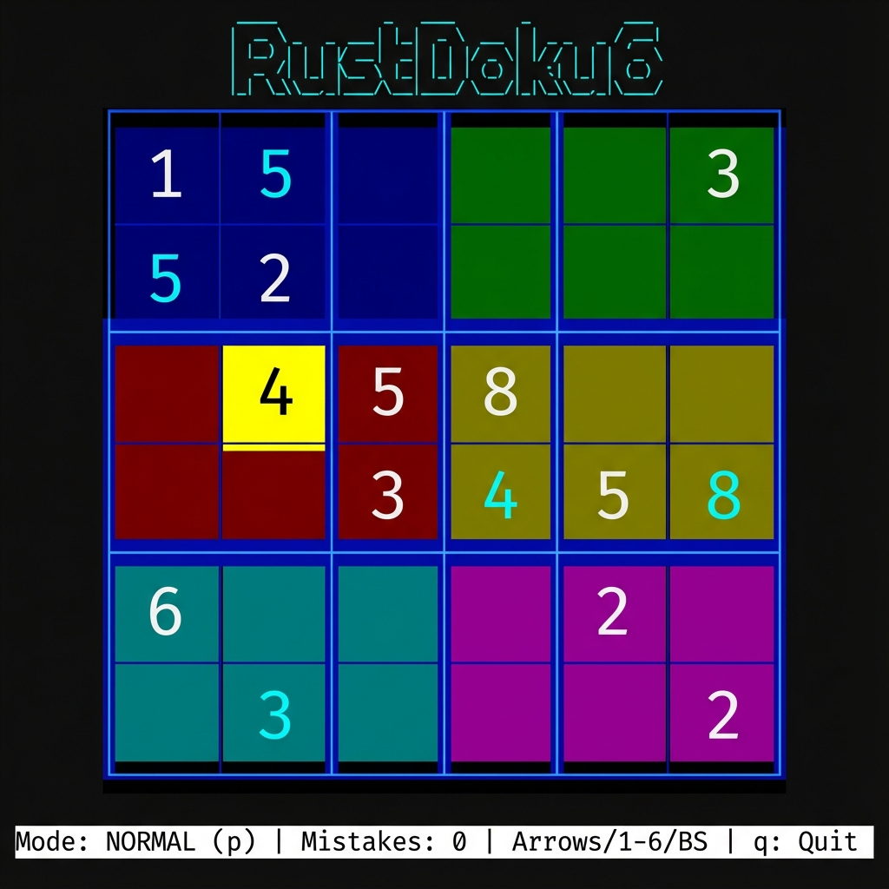

# RustDoku6

**A blazing fast, 6x6 Sudoku TUI with dynamic puzzle generation and pencil marks.**

[](LICENSE)
[]()
[]()

---

## The Problem

Sometimes you just need to take a break from heavy mental work, or you have a few minutes while a long compile job runs. Opening a browser for a game means dealing with ads, tracking, and distractions.

**Old way:** Searching for "sudoku online", wading through cookie banners, or dealing with clunky mobile interfaces.

**RustDoku6:** A quick, mental palate cleanser in your terminal. Instant startup, keyboard-centric control, and infinite unique puzzles generated right on your machine. No ads, no tracking, just pure logic to reset your brain.

---

## Quick Demo



(Screenshots generated with Gemini)

---

## Install

```bash
git clone https://github.com/jxmullins/rustdoku6.git
cd rustdoku6
cargo run
```

---

## Usage

| Action | Command |
|--------|---------|
| **Move Cursor** | `Arrow Keys` |
| **Enter Number** | `1` - `6` |
| **Toggle Mode** | `p` (Normal / Pencil) |
| **Clear Cell** | `Backspace` |
| **Quit** | `q` |

---

## Features

- **Infinite Puzzles** — Uses a backtracking algorithm to generate a unique, valid solution every time.
- **Pencil Mode** — Toggle candidate marks (`1-6`) without marking the cell as solved.
- **Smart Validation** — "Truth-based" validation checks your moves against the actual solution, ensuring you never go down a dead end.
- **Visual Feedback** — Explicit numbers have a solid background, while single pencil marks show as colored text, making the game state readable at a glance.
- **Beautiful TUI** — Inverted grid lines and distinct region colors for a premium terminal experience.

---

## Why I Built This

I wanted to explore Rust's TUI ecosystem with `ratatui` and create a small, polished game that I would actually play. Building a Sudoku generator from scratch was a fun algorithmic challenge, and fitting it into a clean terminal interface forced me to think about UX in a constrained environment.

---

## Support

If this project helps you, consider buying me a coffee:

[](https://buymeacoffee.com/jxmullins)

## Contributing

Ideas and contributions welcome! Open an issue or submit a PR.

## License

MIT — Use it, share it, modify it.
